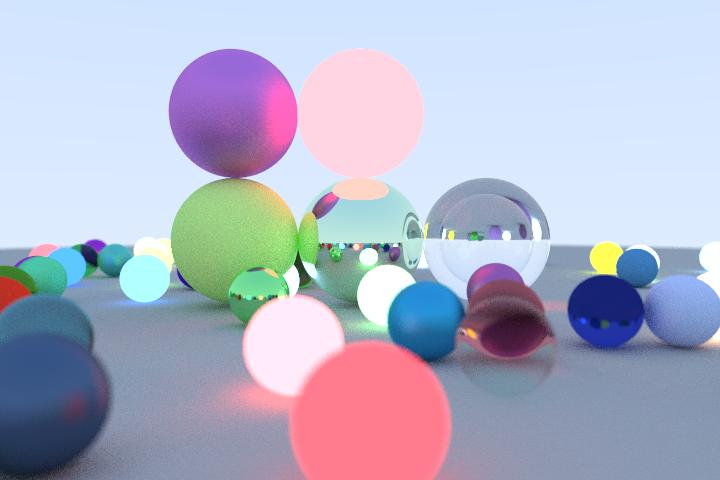
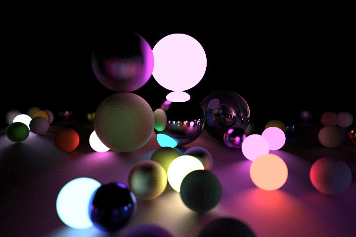
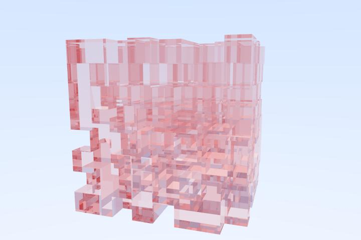
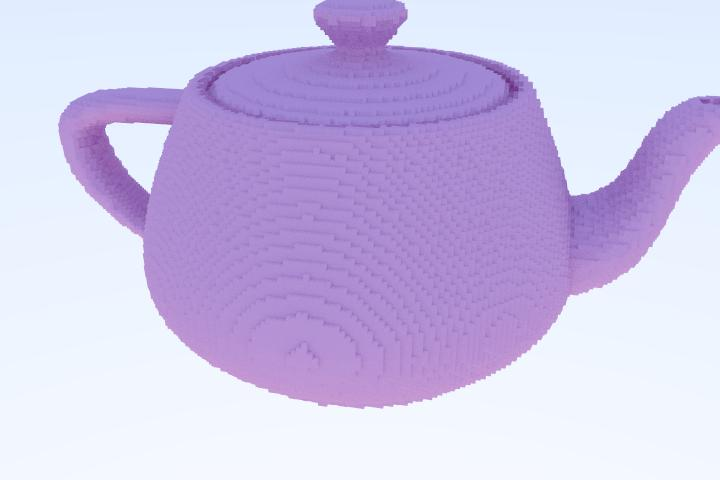
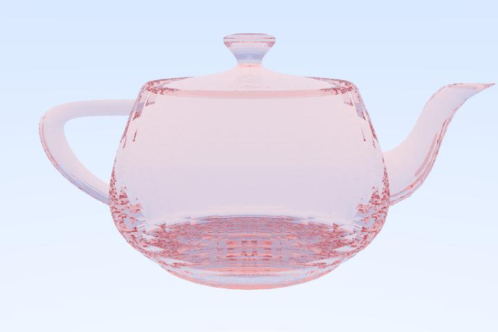
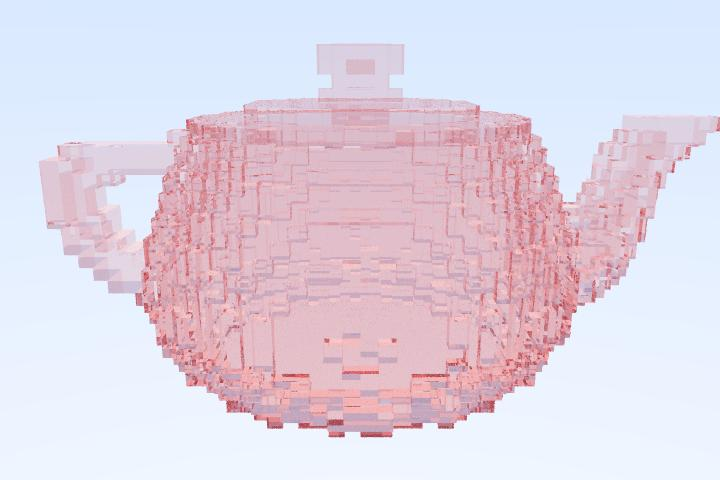

# about
this is a multithreaded cpu path tracer.
i gave up on the go implementation because of the speed of my implementation but the rust implimentation was bareable

# some images rendered using tathpracer







# how to run
- clone repo
- cd to rust dir
- run ```cargo run --release```
- try different scenes by uncommenting/commenting lines src/scene.rs

# features
- loosely follows the theory from [ray tracing in one weekend](https://github.com/RayTracing/raytracing.github.io) with following extra features
- SVO implimentation + ray intersections
- different materials: metallic, diffuse, dielectric, glowing matt surfaces
- objects: sphere, plane, triangles, triangle octree, voxel octree
- import .obj triangle meshes
  - only triangle meshes supported 
  - colors not supported
- triangles are stored in SVO after importing
- simple conversion from triangle meshes to SVO